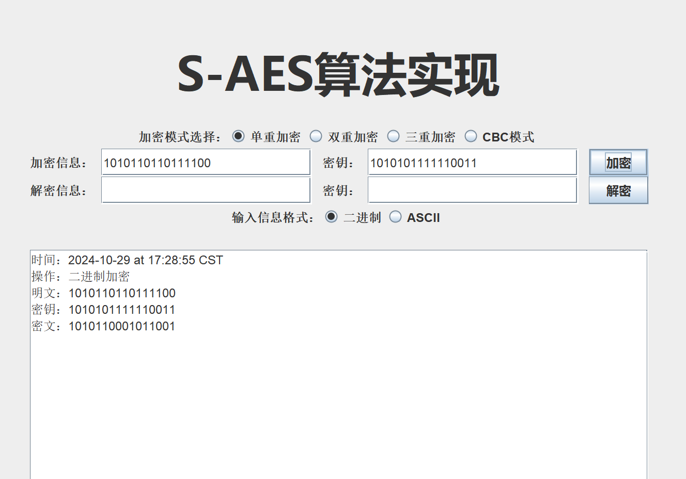

# S-AES 加密算法用户指南

## 1.介绍

S - AES（Advanced Data Encryption Standard，即高级数据加密标准）乃是一种经过简化的数据加密标准，其常常在教育以及学术领域中得以应用。本用户指南将为您详尽阐述如何运用 S - AES 算法来实现对文本数据的加密与解密操作。

- 文档目的：本用户指南的核心宗旨在于助力用户深入了解并熟练运用基于 Java 所开发的 S_AES 加密算法应用程序，该程序涵盖了二进制加密、ascll 加密、双重加密、三重加密、中间相遇攻击以及工作模式等多个模块。
- 适用范围：适用于那些有对数据进行加密和解密操作需求的用户，他们可直接借助本程序开展加解密操作；同时，也为对密码学和网络安全怀有浓厚兴趣的技术爱好者提供一定程度的专业参考价值

### 1.1 主要功能

- **加密**：将明文转换为密文，使用密钥进行加密。
- **解密**：将密文转换回明文，使用相同的密钥进行解密。

## 2.安装和使用

### 2.1 下载和导入代码

1. 下载地址：[S-AES代码仓库](https://github.com/MoonlightAFar/S-AES)
2. 运行环境：JDK1.8
3. 操作步骤：您可以从[S-AES代码仓库](https://github.com/MoonlightAFar/S-AES)中下载 S-AES 算法的 Java 代码。然后，将代码导入您喜欢的 Java 集成开发环境（IDE）中。

### 2.2 可视化界面说明

以下图片为软件可视化界面操作的功能说明：
 

### 2.3 功能简介

- 二进制加密：用户输入明文后，可获取随机密钥，通过 S_AES 加密算法对其进行加密操作，进而生成密文。此外，还能够输入密文与密钥，反向获取明文。
  
  

- ascll 加密：用户输入 ascll 明文后，可获取随机密钥，借助 S_AES 加密算法进行加密，生成密文。同样，也可以输入密文和密钥来反向获取明文。
  
  

- 双重加密：与二进制加密类似，然而每次是使用两把密钥进行加解密操作。
  
  

- 三重加密：与二进制加密类似，只是每次需使用三把密钥进行加解密操作。
  
  

- CBC模式：采用密码分组链（CBC）模式对较长的明文消息进行加密处理。输入明文和密钥后，获取初始向量，然后加密得到结果。解密时，输入密文、密钥和初始向量即可获得明文。
  
  

### 2.4 密钥生成

在开始使用 S-AES 进行加密和解密之前，您需要准备一个16的整数倍位的二进制密钥。这个密钥将用于加密和解密过程。

## 3.注意事项

1. 进行操作前请注意输入信息格式，否则本软件将会弹出提示框进行提醒

2. 请确保输入的内容与要求的格式相符
   
   - 输入信息规格为：16位二进制字符串或者ASCII字符码
   - 密钥规格为：16的整数倍位二进制字符串
     - 多重加密次数为：密钥长度 / 16

3. 进行解密操作时，请输入由本软件加密后的密文，否则可能会得到乱码的解密信息

4. 解密操作时需要使用与加密操作相同的密钥，否则将无法得到原明文
   
   

## 4.维护与更新

本程序由开发者负责进行维护以及更新操作。在后续的发展进程中，可能会增添新的功能，从而为用户带来更丰富、更优质的使用体验。

用户若期望获取到该程序的最新版本，可以通过访问作者的github账号，以获取最新版本。

## 5.附录

### 5.1 术语表

- S_AES 加密算法：一种加密算法，在该应用程序中用于对数据进行加密和解密操作。
- 二进制加密：应用程序中的一个模块，对用户输入的明文通过 S_AES 加密算法进行加密，生成密文，可反向解密，密钥随机生成。
- ascll 加密：应用程序中的一个模块，对用户输入的 ascll 明文进行加密，生成密文，可反向解密，密钥随机生成。
- 双重加密：类似二进制加密，但使用两把密钥进行加解密。
- 三重加密：类似二进制加密，但使用三把密钥进行加解密。
- 中间相遇攻击：应用程序中的一个功能，输入明文和密文，破解出双重加密的两把密钥。
- 工作模式：应用程序中的一个模块，使用密码分组链（CBC）模式对较长的明文消息进行加密和解密，需要输入明文、密钥和初始向量。
- 明文：未加密的原始文本。
- 密文：经过加密后的文本。
- 密钥：用于加密和解密的关键信息。
- 初始向量：在密码分组链（CBC）模式中用于初始化加密过程的随机值。

### 5.2 参考资料

- 《信息安全导论》

## 6.鸣谢

- 课程名称：信息安全导论
- 教学班级：992987-002
- 任课教师：向宏
- 单位：重庆大学大数据与软件学院
- 小组：数据三剑客
- 若有任何疑问或建议，请联系开发团队：[1401438790@qq.com](mailto:1401438790@qq.com)


# S-AES 加密算法开发手册

## 1.代码结构

S-AES 加密算法的实现主要分布在多个 Java 类文件中，每个类承担不同的功能模块。以下是各个类及其简要描述：

- **ASCII**: 负责 ASCII 编码相关的加密和解密操作。
- **AttackInMiddle**: 提供中间人攻击的实现，用于破解加密。
- **CBC**: 实现密码块链（CBC）模式的加密和解密。
- **Cipher**: 提供加密操作的核心功能。
- **Decipher**: 提供解密操作的核心功能。
- **KeyExpansion**: 负责密钥扩展。
- **NewGUI**: 提供图形用户界面（GUI），用于用户交互。
- **RoundKey**: 提供密钥轮次处理。
- **SBox**: 提供 S 盒和逆 S 盒的实现。

## 2. 主要类和方法

### 2.1 ASCII 类

#### 2.1.1 asciiEncipher(String Begin, String Key)

- **功能**: 将输入的字符串 `Begin` 根据提供的16位密钥 `Key` 进行加密。
- **流程**:
  1. 遍历输入字符串的每个字符，将其ASCII值转换为二进制。
  2. 使用密钥对二进制字符串进行加密。
  3. 将加密后的二进制字符串转换回字符并拼接。

#### 2.1.2 asciiEncipher2(String Begin, String key)

- **功能**: 使用两个16位密钥对输入字符串 `Begin` 进行双重加密。
- **流程**:
  1. 使用第一个密钥对输入字符串进行加密。
  2. 使用第二个密钥对第一步的输出结果进行再次加密。

#### 2.1.3 asciiEncipher3(String input, String key)

- **功能**: 使用三个16位密钥对输入字符串 `input` 进行三重加密。
- **流程**:
  1. 使用第一个密钥对输入字符串进行加密。
  2. 使用第二个密钥对第一步的输出结果进行解密。
  3. 使用第三个密钥对第二步的输出结果进行加密。

#### 2.1.4 asciiDecipher(String Begin, String Key)

- **功能**: 将加密后的字符串 `Begin` 根据提供的16位密钥 `Key` 进行解密。
- **流程**:
  1. 遍历加密字符串的每个字符，将其ASCII值转换为二进制。
  2. 使用密钥对二进制字符串进行解密。
  3. 将解密后的二进制字符串转换回字符并拼接。

#### 2.1.5 asciiDecipher2(String input, String key)

- **功能**: 使用两个16位密钥对加密字符串 `input` 进行双重解密。
- **流程**:
  1. 使用第二个密钥对加密字符串进行解密。
  2. 使用第一个密钥对第一步的输出结果进行再次解密。

#### 2.1.6 asciiDecipher3(String input, String key)

- **功能**: 使用三个16位密钥对加密字符串 `input` 进行三重解密。
- **流程**:
  1. 使用第三个密钥对加密字符串进行解密。
  2. 使用第二个密钥对第一步的输出结果进行加密。
  3. 使用第一个密钥对第二步的输出结果进行解密。

### 2.2 Cipher 类

#### 2.2.1 cipher(String input, String Key)

- **功能**: 对输入的二进制字符串 `input` 使用密钥 `Key` 进行单轮加密。
- **流程**:
  1. 执行 `RoundKey.key_addition` 将输入与密钥进行异或操作。
  2. 执行 `Round_1` 进行第一轮加密处理。
  3. 执行 `Round_2` 进行第二轮加密处理。

#### 2.2.2 cipher2(String input, String key)

- **功能**: 对输入的二进制字符串 `input` 使用两个密钥进行双重加密。
- **流程**:
  1. 使用第一个密钥对输入字符串进行单轮加密。
  2. 使用第二个密钥对第一步的输出结果进行再次单轮加密。

#### 2.2.3 cipher3(String input, String key)

- **功能**: 对输入的二进制字符串 `input` 使用三个密钥进行三重加密。
- **流程**:
  1. 使用第一个密钥对输入字符串进行单轮加密。
  2. 使用第二个密钥对第一步的输出结果进行解密。
  3. 使用第三个密钥对第二步的输出结果进行单轮加密。

### 2.3 Decipher 类

#### 2.3.1 decipher(String input, String Key)

- **功能**: 对加密的二进制字符串 `input` 使用密钥 `Key` 进行单轮解密。
- **流程**:
  1. 执行 `RoundKey.key_addition` 将输入与密钥进行异或操作。
  2. 执行 `Round_1` 进行第一轮解密处理。
  3. 执行 `Round_2` 进行第二轮解密处理。

#### 2.3.2 decipher2(String input, String key)

- **功能**: 对加密的二进制字符串 `input` 使用两个密钥进行双重解密。
- **流程**:
  1. 使用第二个密钥对加密字符串进行单轮解密。
  2. 使用第一个密钥对第一步的输出结果进行再次单轮解密。

#### 2.3.3 decipher3(String input, String key)

- **功能**: 对加密的二进制字符串 `input` 使用三个密钥进行三重解密。
- **流程**:
  1. 使用第三个密钥对加密字符串进行单轮解密。
  2. 使用第二个密钥对第一步的输出结果进行加密。
  3. 使用第一个密钥对第二步的输出结果进行单轮解密。

### 2.4 CBC 类

#### 2.4.1 CBCcipher(String Begin, String Key)

- **功能**: 使用密码块链（CBC）模式对字符串 `Begin` 进行加密。
- **流程**:
  1. 初始化向量 IV。
  2. 对输入字符串进行分块处理，每块16位。
  3. 将每一块与当前 IV 进行异或操作后加密。
  4. 更新 IV 为上一块的加密结果。

#### 2.4.2 CBCdecipher(String Begin, String Key)

- **功能**: 使用密码块链（CBC）模式对字符串 `Begin` 进行解密。
- **流程**:
  1. 初始化向量 IV。
  2. 对输入字符串进行分块处理，每块16位。
  3. 将每一块先与 IV 进行异或操作后解密。
  4. 更新 IV 为当前块的加密结果。

### 2.5 KeyExpansion 类

#### 2.5.1 key_Expansion(int Key)

- **功能**: 对输入的密钥进行扩展，生成多轮加密所需的密钥。
- **流程**:
  1. 将密钥分为两部分。
  2. 通过一系列操作（位移、S盒替换、轮密钥生成函数）生成多轮密钥。

### 2.6 RoundKey 类

#### 2.6.1 Half_Byte_Replace(String a)

- **功能**: 对输入的二进制字符串进行半字节替换。
- **流程**:
  1. 将输入字符串分为两个半字节。
  2. 通过 S 盒对每个半字节进行替换。
  3. 将替换后的半字节重新组合。

#### 2.6.2 Line_Shift(String a)

- **功能**: 对输入的二进制字符串进行行位移。
- **流程**:
  1. 将输入字符串分为四个部分。
  2. 按照预定的模式对各部分进行位移。
  3. 将位移后的部分重新组合。

#### 2.6.3 Column_Confusion(String a)

- **功能**: 对输入的二进制字符串进行列混淆。
- **流程**:
  1. 将输入字符串分为四个部分。
  2. 通过特定的数学运算对各部分进行混淆。
  3. 将混淆后的部分重新组合。

### 2.7 SBox 类

#### 2.7.1 s_box(int input)

- **功能**: 通过 S 盒对输入的整数进行替换。
- **流程**:
  1. 将输入整数分为高四位和低四位。
  2. 在 S 盒中查找对应的替换值。
  3. 将替换后的值重新组合。

#### 2.7.2 s_box_1(int input)

- **功能**: 通过逆 S 盒对输入的整数进行替换。
- **流程**:
  1. 将输入整数分为高四位和低四位。
  2. 在逆 S 盒中查找对应的替换值。
  3. 将替换后的值重新组合。

## 3.依赖项

S-AES加密算法的代码没有依赖于外部库或工具，可以直接在Java环境中运行。

## 4.示例用法

### 加密示例

以下是使用 S-AES 加密算法进行加密的示例代码：

```java
public class SAESExample {
    public static void main(String[] args) {
        // 待加密的明文
        String plaintext = "Hello, World!";
        // 密钥，假设为16位二进制字符串
        String key = "0011001100110011";

        // 调用 ASCII 类的加密方法进行加密
        String ciphertext = ASCII.asciiEncipher(plaintext, key);

        // 打印加密后的密文
        System.out.println("密文: " + ciphertext);
    }
}
```

在这个示例中，我们使用 `ASCII` 类的 `asciiEncipher` 方法对字符串 "Hello, World!" 进行加密，密钥为 "0011001100110011"。加密后的结果将被打印出来。

### 解密示例

以下是使用 S-AES 加密算法进行解密的示例代码：

```java
public class SAESExample {
    public static void main(String[] args) {
        // 待解密的密文
        String ciphertext = "加密后得到的密文字符串";
        // 密钥，假设为16位二进制字符串
        String key = "0011001100110011";

        // 调用 ASCII 类的解密方法进行解密
        String decryptedText = ASCII.asciiDecipher(ciphertext, key);

        // 打印解密后的明文
        System.out.println("明文: " + decryptedText);
    }
}
```

在这个示例中，我们使用 `ASCII` 类的 `asciiDecipher` 方法对密文进行解密，密钥仍然是 "0011001100110011"。解密后的结果将被打印出来，理论上应该与原始的明文 "Hello, World!" 相同。

#### 5. 安全性

S-AES 加密算法的安全性基于以下几个关键点：

- **密钥长度**：使用16位密钥，适合一般安全需求。
- **加密模式**：支持单重、双重、三重加密和CBC模式，适用于不同场景。
- **S盒和逆S盒**：提供非线性变换，增强算法抵抗力。
- **密钥扩展**：复杂的密钥扩展机制，提高密钥安全性。

#### 安全性建议：

- 定期更换密钥，避免密钥泄露。
- 根据需求选择合适的加密模式。

## 6. 扩展和定制

S-AES算法支持以下扩展和定制：

- **密钥扩展定制**：可调整密钥长度或自定义密钥生成算法。
- **加密模式扩展**：可开发新的加密模式，如CTR或GCM。
- **S盒和逆S盒定制**：可设计自定义S盒和逆S盒，以适应特定需求。
- **性能优化**：优化算法实现，提高加密解密性能。
- **系统集成**：与其他安全系统集成，提供端到端加密解决方案。

通过这些扩展和定制，S-AES能够适应不同的应用场景，并保持高安全性和可靠性。

## **7.特别鸣谢**

- 课程名称：信息安全导论
- 教学班级：992987-002
- 任课教师：向宏
- 单位：重庆大学大数据与软件学院
- 小组：数据三剑客
- 若有任何疑问或建议，请联系开发团队：[1401438790@qq.com](mailto:1401438790@qq.com) 

## **8.附录**

#### 1、术语表：

- S_AES 加密算法：一种加密算法，在该应用程序中用于对数据进行加密和解密操作。
- 二进制加密：应用程序中的一个模块，对用户输入的明文通过 S_AES 加密算法进行加密，生成密文，可反向解密，密钥随机生成。
- ascll 加密：应用程序中的一个模块，对用户输入的 ascll 明文进行加密，生成密文，可反向解密，密钥随机生成。
- 双重加密：类似二进制加密，但使用两把密钥进行加解密。
- 三重加密：类似二进制加密，但使用三把密钥进行加解密。
- 中间相遇攻击：应用程序中的一个功能，输入明文和密文，破解出双重加密的两把密钥。
- 工作模式：应用程序中的一个模块，使用密码分组链（CBC）模式对较长的明文消息进行加密和解密，需要输入明文、密钥和初始向量。
- 明文：未加密的原始文本。
- 密文：经过加密后的文本。
- 密钥：用于加密和解密的关键信息。
- 初始向量：在密码分组链（CBC）模式中用于初始化加密过程的随机值。

#### 2、参考资料：

- 《信息安全导论》
