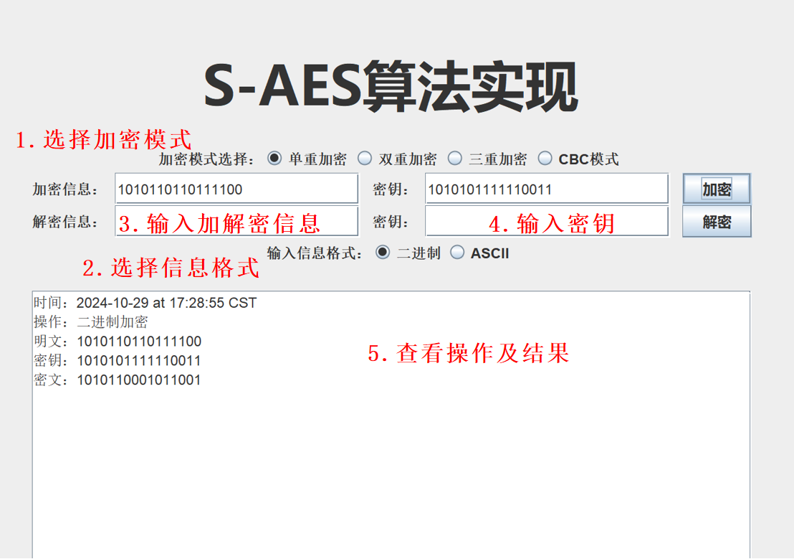
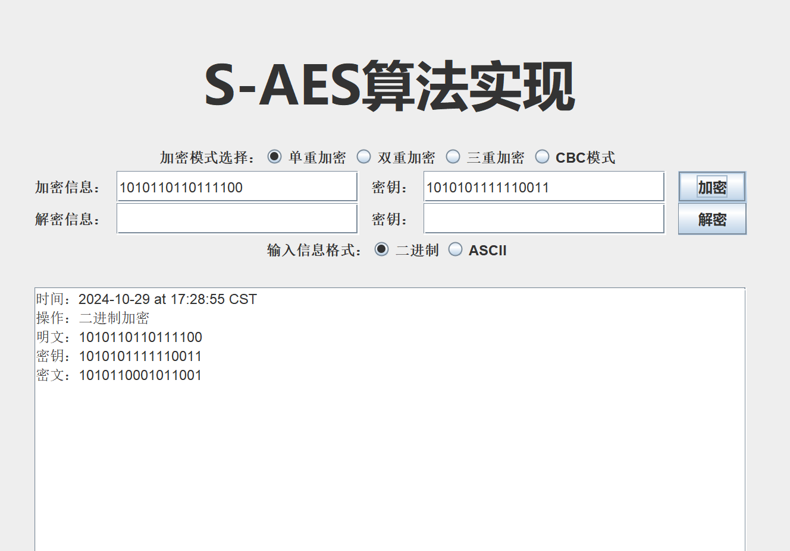
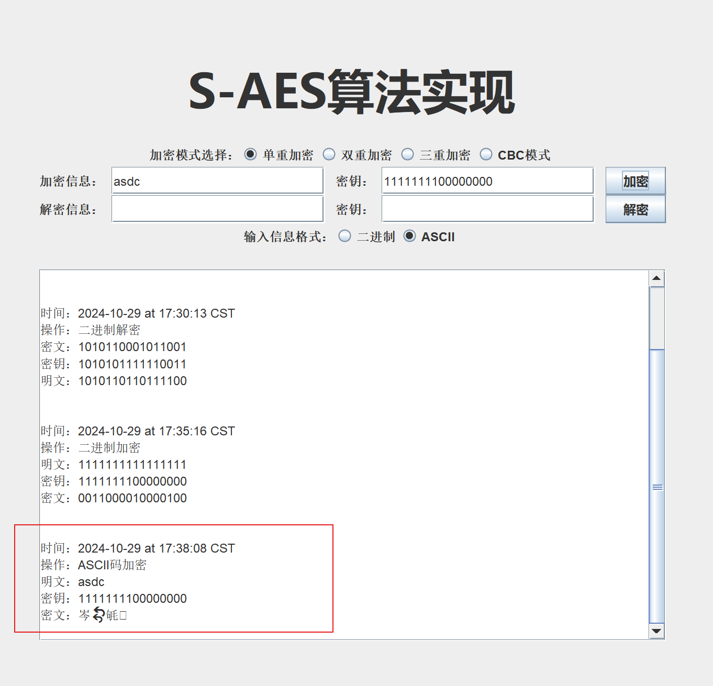
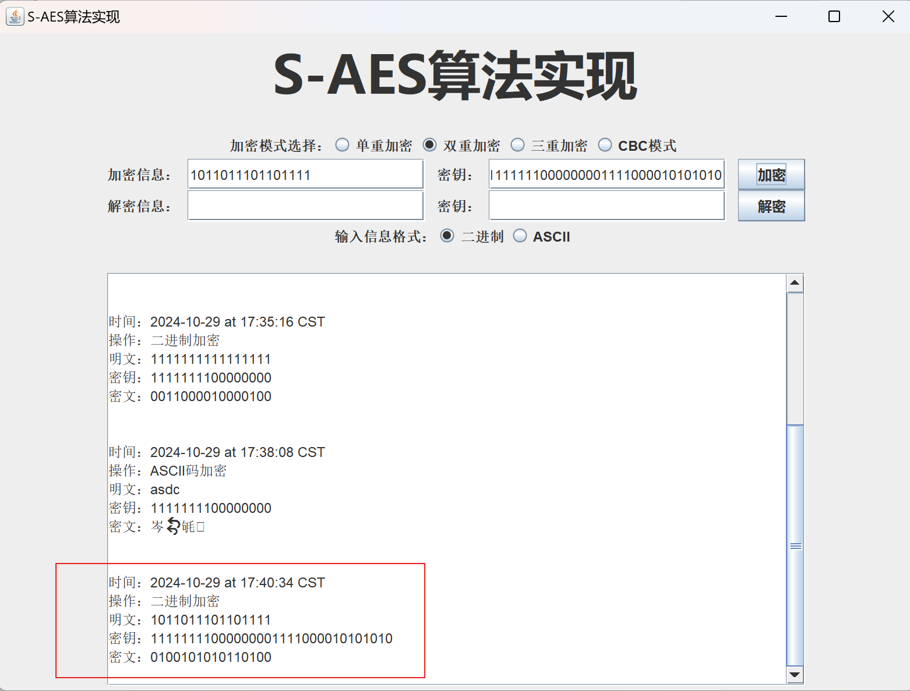
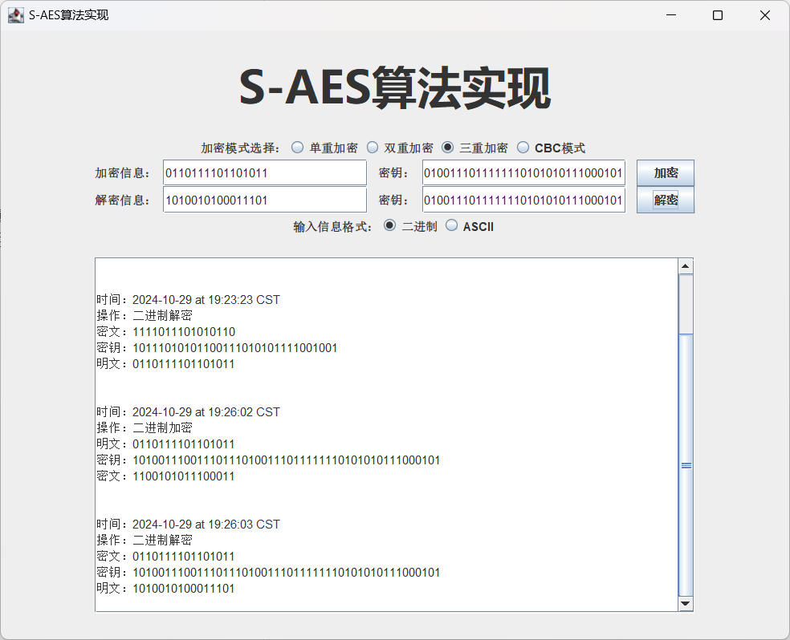
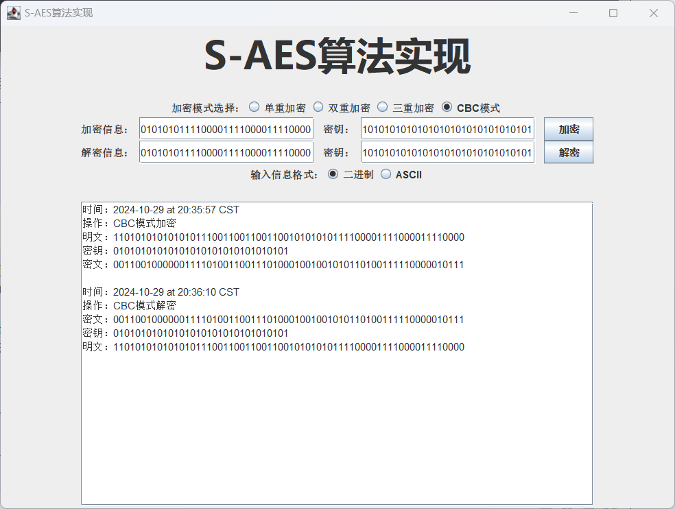
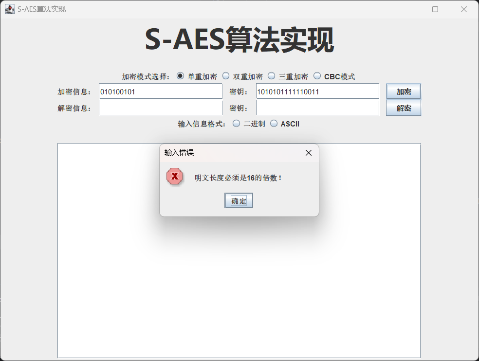

# S-AES 加密算法用户指南

## 1.介绍

S - AES（Advanced Data Encryption Standard，即高级数据加密标准）乃是一种经过简化的数据加密标准，其常常在教育以及学术领域中得以应用。本用户指南将为您详尽阐述如何运用 S - AES 算法来实现对文本数据的加密与解密操作。

- 文档目的：本用户指南的核心宗旨在于助力用户深入了解并熟练运用基于 Java 所开发的 S_AES 加密算法应用程序，该程序涵盖了二进制加密、ascll 加密、双重加密、三重加密、中间相遇攻击以及工作模式等多个模块。
- 适用范围：适用于那些有对数据进行加密和解密操作需求的用户，他们可直接借助本程序开展加解密操作；同时，也为对密码学和网络安全怀有浓厚兴趣的技术爱好者提供一定程度的专业参考价值

### 1.1 主要功能

- **加密**：将明文转换为密文，使用密钥进行加密。
- **解密**：将密文转换回明文，使用相同的密钥进行解密。

## 2.安装和使用

### 2.1 下载和导入代码

1. 下载地址：[S-AES代码仓库](https://github.com/MoonlightAFar/S-AES)
2. 运行环境：JDK1.8
3. 操作步骤：您可以从[S-AES代码仓库](https://github.com/MoonlightAFar/S-AES)中下载 S-AES 算法的 Java 代码。然后，将代码导入您喜欢的 Java 集成开发环境（IDE）中。

### 2.2 可视化界面说明

以下图片为软件可视化界面操作的功能说明：
 

### 2.3 功能简介

- 二进制加密：用户输入明文后，可获取随机密钥，通过 S_AES 加密算法对其进行加密操作，进而生成密文。此外，还能够输入密文与密钥，反向获取明文。
  
  

- ascll 加密：用户输入 ascll 明文后，可获取随机密钥，借助 S_AES 加密算法进行加密，生成密文。同样，也可以输入密文和密钥来反向获取明文。
  
  

- 双重加密：与二进制加密类似，然而每次是使用两把密钥进行加解密操作。
  
  

- 三重加密：与二进制加密类似，只是每次需使用三把密钥进行加解密操作。
  
  

- CBC模式：采用密码分组链（CBC）模式对较长的明文消息进行加密处理。输入明文和密钥后，获取初始向量，然后加密得到结果。解密时，输入密文、密钥和初始向量即可获得明文。
  
  

### 2.4 密钥生成

在开始使用 S-AES 进行加密和解密之前，您需要准备一个16的整数倍位的二进制密钥。这个密钥将用于加密和解密过程。

## 3.注意事项

1. 进行操作前请注意输入信息格式，否则本软件将会弹出提示框进行提醒

2. 请确保输入的内容与要求的格式相符
   
   - 输入信息规格为：16位二进制字符串或者ASCII字符码
   - 密钥规格为：16的整数倍位二进制字符串
     - 多重加密次数为：密钥长度 / 16

3. 进行解密操作时，请输入由本软件加密后的密文，否则可能会得到乱码的解密信息

4. 解密操作时需要使用与加密操作相同的密钥，否则将无法得到原明文
   
   

## 4.维护与更新

本程序由开发者负责进行维护以及更新操作。在后续的发展进程中，可能会增添新的功能，从而为用户带来更丰富、更优质的使用体验。

用户若期望获取到该程序的最新版本，可以通过访问作者的github账号，以获取最新版本。

## 5.附录

### 5.1 术语表

- S_AES 加密算法：一种加密算法，在该应用程序中用于对数据进行加密和解密操作。
- 二进制加密：应用程序中的一个模块，对用户输入的明文通过 S_AES 加密算法进行加密，生成密文，可反向解密，密钥随机生成。
- ascll 加密：应用程序中的一个模块，对用户输入的 ascll 明文进行加密，生成密文，可反向解密，密钥随机生成。
- 双重加密：类似二进制加密，但使用两把密钥进行加解密。
- 三重加密：类似二进制加密，但使用三把密钥进行加解密。
- 中间相遇攻击：应用程序中的一个功能，输入明文和密文，破解出双重加密的两把密钥。
- 工作模式：应用程序中的一个模块，使用密码分组链（CBC）模式对较长的明文消息进行加密和解密，需要输入明文、密钥和初始向量。
- 明文：未加密的原始文本。
- 密文：经过加密后的文本。
- 密钥：用于加密和解密的关键信息。
- 初始向量：在密码分组链（CBC）模式中用于初始化加密过程的随机值。

### 5.2 参考资料

- 《信息安全导论》

## 6.鸣谢

- 课程名称：信息安全导论
- 教学班级：992987-002
- 任课教师：向宏
- 单位：重庆大学大数据与软件学院
- 小组：数据三剑客
- 若有任何疑问或建议，请联系开发团队：[1401438790@qq.com](mailto:1401438790@qq.com)
